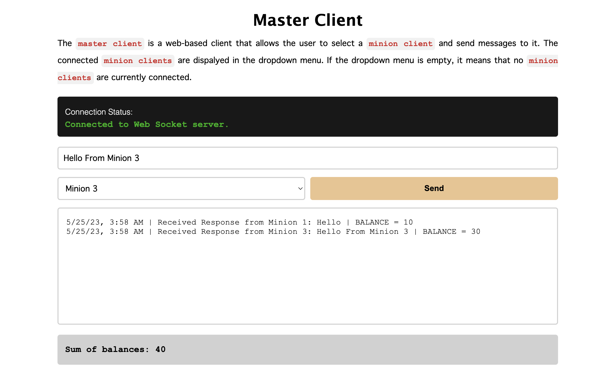

# WebSocket Application

This application consists of a Master Client, a server, and multiple Minion Clients. The Master Client allows you to send messages to the Minion Clients via a WebSocket connection. This README provides instructions on how to run the application.

<br>

### Running the Application

<hr>

1.  Install the dependencies by navigating to the project's root directory and running:
    ```
    npm install
    ```
2.  Open the `index.html` file in any web browser. This will launch the Master Client interface.
3.  Run the server and Minion Clients using one of the two options below:

    a. Using Node.js scripts (with `concurrently`)
    <hr>

    - Easier to get started.
    - Difficult to seperate console logs for each process.

        <br>

        ```
        npm run dev
        ```

    b. Running each script individually (in separate terminals)
    <hr>

    - Easier to see console logs for each process.
    - Run Server: From the root folder:

            ```
            cd server && node index.js
            ```

    - Run Minion Clients: from the root folder:

            ```
            cd server && node mclient1.js
            ```

            ```
            cd server && node mclient2.js
            ```

            ```
            cd server && node mclient3.js
            ```

    <br>

### Web-based Master Client

<hr>

<!-- Add image -->

